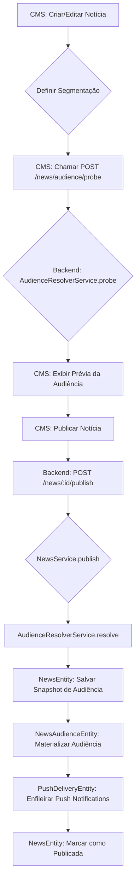
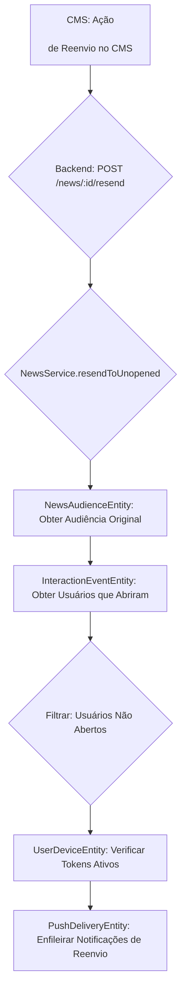

# Documentação do Módulo de Notícias

Este documento detalha a implementação do módulo de notícias, incluindo segmentação de audiência, publicação, reenvio e métricas, conforme o briefing fornecido.

## 1. Desenho de Fluxo: Publicação e Reenvio de Notícias

O fluxo de publicação e reenvio de notícias segue as seguintes etapas:

### Publicação de Notícia

1.  **Criação/Edição:** Um administrador cria ou edita uma notícia no CMS.
2.  **Definição de Audiência:** No formulário do CMS, o administrador define o modo de segmentação (Empresa, Espaço, Canal, Grupos) e os parâmetros correspondentes.
3.  **Probe de Audiência:** O CMS chama o endpoint `/news/audience/probe` no backend para obter uma prévia da audiência (total de usuários elegíveis e com token ativo).
4.  **Publicação:** Ao clicar em "Publicar", o CMS envia a notícia para o endpoint `POST /news/:id/publish`.
5.  **Resolução de Audiência (Backend):** O `NewsService` utiliza o `AudienceResolverService` para resolver a audiência final com base no `audienceMode` e seus parâmetros.
6.  **Snapshot de Audiência:** Um snapshot da audiência resolvida (total de usuários, com token ativo, modo e identificadores) é salvo na entidade `NewsEntity`.
7.  **Materialização da Audiência:** A lista de `userIds` elegíveis é materializada na tabela `NewsAudienceEntity` (`news_audience`), com uma entrada para cada usuário, `newsId` e `companyId`, e a `origemDaRegra`.
8.  **Enfileiramento de Push:** Para os usuários com token de push ativo, registros são criados na tabela `PushDeliveryEntity` (`push_delivery`) com status `queued`, para serem processados por um serviço de envio de push.
9.  **Atualização da Notícia:** A notícia é marcada como `isPublished: true` e `publishedAt` é definido.



### Reenvio para Quem Não Abriu

1.  **Solicitação de Reenvio:** No detalhe da notícia no CMS, o administrador clica em "Reenviar para quem não viu", chamando o endpoint `POST /news/:id/resend`.
2.  **Identificação da Audiência Original:** O `NewsService` consulta a `NewsAudienceEntity` para obter a lista original de `userIds` que deveriam ter recebido a notícia.
3.  **Identificação de Aberturas:** O `NewsService` consulta a `InteractionEventEntity` para identificar quais usuários da audiência original já registraram um evento `OPEN` para essa notícia.
4.  **Filtragem de Não Abertos:** É criada uma lista de `userIds` que estavam na audiência original, mas que ainda não abriram a notícia.
5.  **Verificação de Tokens Ativos:** Para a lista de não abertos, verifica-se quais usuários possuem tokens de push ativos através da `UserDeviceEntity`.
6.  **Enfileiramento de Reenvio:** Para os usuários identificados (não abertos e com token ativo), novos registros são criados na `PushDeliveryEntity` com status `queued` e um `meta` indicando o lote de reenvio.



## 2. APIs (Contratos Esperados)

As seguintes APIs foram implementadas ou ajustadas no backend NestJS:

### 2.1. `POST /news` - Criar Notícia

**Descrição:** Cria uma nova notícia.
**Corpo da Requisição (exemplo):**
```json
{
  "title": "Nova Notícia Importante",
  "subtitle": "Um subtítulo cativante",
  "content": "Conteúdo completo da notícia...",
  "channelId": "uuid-do-canal",
  "type": "ANNOUNCEMENT",
  "attachments": [],
  "highlightImages": [],
  "settings": {
    "audienceMode": "COMPANY",
    "allowComments": true,
    "notifyUsers": true,
    "pushNotification": true
  }
}
```

### 2.2. `PUT /news/:id` - Atualizar Notícia

**Descrição:** Atualiza uma notícia existente.
**Corpo da Requisição (exemplo):**
```json
{
  "title": "Título Atualizado",
  "settings": {
    "allowComments": false
  }
}
```

### 2.3. `GET /news` - Listar Notícias

**Descrição:** Retorna uma lista de notícias. Pode ser filtrado por `channelId`.
**Parâmetros de Query:**
- `channelId` (opcional): `string` - ID do canal para filtrar notícias.

### 2.4. `GET /news/:id` - Obter Notícia por ID

**Descrição:** Retorna os detalhes de uma notícia específica.

### 2.5. `POST /news/:id/publish` - Publicar Notícia

**Descrição:** Publica uma notícia, resolve a audiência, materializa e enfileira pushes.
**Corpo da Requisição:** Vazio (os dados são obtidos da notícia e do token do usuário).

### 2.6. `POST /news/:id/resend` - Reenviar para Quem Não Viu

**Descrição:** Reenvia a notificação de uma notícia para os usuários da audiência original que ainda não abriram a notícia e possuem token ativo.
**Corpo da Requisição:** Vazio.

### 2.7. `POST /news/audience/probe` - Prévia de Audiência

**Descrição:** Calcula e retorna uma prévia da audiência para um determinado modo de segmentação.
**Corpo da Requisição (exemplo):**
```json
{
  "mode": "SPACE",
  "spaceId": "uuid-do-espaco"
}
```
**Resposta (exemplo):**
```json
{
  "totalUsuarios": 150,
  "comTokenAtivo": 120,
  "mode": "SPACE",
  "identifiers": {
    "spaceId": "uuid-do-espaco"
  }
}
```

### 2.8. `GET /news/:id/statistics` - Estatísticas da Notícia

**Descrição:** Retorna métricas e estatísticas detalhadas para uma notícia.

### 2.9. `GET /news/:id/statistics/unopened` - Usuários que Não Abriram

**Descrição:** Retorna a lista de usuários que fazem parte da audiência original, mas ainda não abriram a notícia.

## 3. Modelagem de Dados (Revisão e Ajustes)

### `NewsEntity`

- Adicionado `publishedAt: Date` para registrar a data de publicação.
- O campo `settings` (`JSONB`) na `NewsEntity` foi estendido para incluir:
  - `audienceMode: AudienceMode` (enum: COMPANY, SPACE, CHANNEL, GROUPS)
  - `audienceSpaceId?: string`
  - `audienceChannelIds?: string[]`
  - `audienceGroupIds?: string[]`
  - `audienceSnapshot?: { totalUsuarios: number; comTokenAtivo: number; mode: AudienceMode; identifiers: Record<string, any>; }` para armazenar o resultado do probe no momento da publicação.

### `NewsAudienceEntity`

- Adicionado `origemDaRegra?: string` para rastrear como o usuário foi incluído na audiência.
- Foi adicionado um índice único para (`companyId`, `newsId`, `userId`) para garantir a idempotência na materialização da audiência.

### `InteractionEventEntity`

- O tipo `InteractionEventType` foi expandido para incluir `REACTION`, `COMMENT`, `SHARE`.
- Adicionado um índice único parcial para eventos `OPEN` em (`companyId`, `newsId`, `userId`, `type`) com a condição `WHERE 

`"type" = 'OPEN'`)

(`"type" = 'OPEN'`). Isso garante que múltiplas tentativas de registrar um `OPEN` para a mesma notícia e usuário dentro de uma janela curta (ou sem alteração de metadados) não resultem em duplicatas no banco de dados.

### `PushDeliveryEntity`

- Utilizada para registrar o status de entrega das notificações push. Não sofreu alterações estruturais diretas, mas agora é fundamental para o fluxo de publicação e reenvio, especialmente no rastreamento de `openedAt`.

### `UserDeviceEntity`

- Utilizada para identificar dispositivos com tokens de push ativos. Não sofreu alterações estruturais diretas, mas é crucial para o `AudienceResolverService` e para o enfileiramento de pushes.

## 4. Decisões de Arquitetura (ADR Curto)

### 4.1. Centralização da Resolução de Audiência

- **Decisão:** Criar um `AudienceResolverService` independente no backend.
- **Justificativa:** Garante uma única fonte de verdade para a lógica de segmentação, evitando duplicação de código e inconsistências em diferentes partes do sistema (e.g., publicação, reenvio, filtragem no app).
- **Impacto:** Facilita a manutenção, testes e futuras extensões dos modos de segmentação.

### 4.2. Idempotência na Publicação e Eventos OPEN

- **Decisão:** Implementar mecanismos de idempotência para a materialização da audiência e registro de eventos `OPEN`.
- **Justificativa:** Previne a duplicação de dados (linhas na `NewsAudienceEntity`, múltiplos `OPEN` para a mesma visualização) que poderiam distorcer as métricas e a lógica de reenvio.
- **Implementação:**
    - **`NewsAudienceEntity`:** Confia-se na constraint de chave primária composta (`companyId`, `newsId`, `userId`) para evitar duplicatas, com o `NewsService` tratando possíveis erros de violação de forma graciosa (e.g., `ON CONFLICT DO NOTHING`).
    - **`InteractionEventEntity`:** Utiliza um índice único parcial no TypeORM para eventos `OPEN` (`companyId`, `newsId`, `userId`, `type` WHERE `type` = 'OPEN'), garantindo que um `OPEN` para a mesma notícia e usuário seja registrado apenas uma vez no banco de dados.

### 4.3. `Defense in Depth` na Filtragem de Notícias (App)

- **Decisão:** Implementar filtragem de notícias tanto no backend quanto no cliente (app mobile).
- **Justificativa:** Garante que o usuário veja apenas as notícias para as quais ele é elegível, mesmo que haja falhas ou caches desatualizados em uma das camadas. O backend garante que apenas notícias elegíveis sejam enviadas, e o cliente faz uma checagem final.
- **Impacto:** Aumenta a segurança e a consistência da experiência do usuário, minimizando riscos de exposição de conteúdo indevido.

## 5. Plano de Testes (Mínimo)

### 5.1. Testes Unitários (`AudienceResolverService`)

- **Cenários:**
    - **COMPANY:** Publicar notícia; conferir snapshot; abrir com 3 usuários; conferir métricas e reenvio.
    - **SPACE:** Alterar membership do usuário para dentro/fora de um grupo alvo de um space e validar o filtro.
    - **CHANNEL:** Usar múltiplos channels; verificar se a audiência é a união sem duplicar usuários.
    - **GROUPS:** Usar múltiplos grupos; verificar união correta; comparar resultado do `probe` vs. `snapshot`.

### 5.2. Testes de Integração (`NewsService` e `NewsController`)

- **Cenários:**
    - **Publicação:**
        - Publicar uma notícia com cada `AudienceMode` (COMPANY, SPACE, CHANNEL, GROUPS).
        - Verificar se o `snapshot` de audiência na `NewsEntity` corresponde aos valores do `probe`.
        - Confirmar que a `NewsAudienceEntity` contém exatamente os usuários elegíveis da publicação.
        - Verificar que o push inicial é enfileirado apenas para quem tem token ativo na hora da publicação.
    - **Reenvio:**
        - Publicar uma notícia.
        - Alguns usuários abrem a notícia, outros não.
        - Clicar em "Reenviar para quem não viu".
        - Confirmar que somente os usuários que não abriram recebem o reenvio e que os `OPEN` subsequentes são registrados corretamente.
    - **Deduplicação de OPEN:**
        - Simular abertura/fechamento/abertura rápida da mesma notícia no app.
        - Verificar se o contador total de `OPEN` não dobra (apenas um `OPEN` único por usuário por visualização).

### 5.3. Testes de Interface (CMS e App)

- **CMS:**
    - Validar o formulário de notícias: seleção de modo, campos dinâmicos, botão "Calcular Audiência" e exibição da prévia.
    - Verificar o detalhe da notícia: exibição do snapshot de audiência, botão "Enviar push" desativado após publicação, e botão "Reenviar para quem não viu" ativo.
    - Validar a página de estatísticas: cartões, séries e tabelas batendo com os eventos reais. Testar a exportação CSV de "quem não abriu".
- **App Mobile:**
    - Abrir a notícia; confirmar que apenas um `OPEN` é contabilizado por abertura de tela.
    - Validar que o app nunca mostra notícia fora do escopo de segmentação do usuário (filtragem backend e cliente).

## 6. Script Seed Mínimo para QA

Será fornecido um script `seed` atualizado que permita criar dados de teste para:

- Múltiplas empresas, espaços, canais e grupos.
- Usuários de teste com diferentes associações a grupos.
- Notícias de exemplo com diversas configurações de segmentação.
- Dispositivos de usuário com tokens de push ativos/inativos.

Este script facilitará a reprodução dos cenários de teste e a validação das funcionalidades por parte da equipe de QA.

## 7. Fluxo de Versionamento

O desenvolvimento seguirá o fluxo de trabalho baseado em Git, com as seguintes diretrizes:

1.  **Branch Temática:** Criação de uma branch específica para esta feature: `feature/news-audience-refactor`.
2.  **Commits:** Commits pequenos e atômicos, com mensagens claras e seguindo um padrão convencional (e.g., `feat(news): add audience resolver`, `fix(news): dedupe open events`).
3.  **Pull Request (PR):** Abertura de um Pull Request para a branch `main` (ou `develop`, dependendo da estratégia do projeto) contendo:
    - Descrição detalhada do que foi feito.
    - Instruções claras sobre como testar as novas funcionalidades.
    - Screenshots do CMS (formulário e estatísticas) para validação visual.
    - Checklist de aceite (baseado nos "Critérios de Aceite" do briefing).
4.  **Code Review:** O código será revisado por outro desenvolvedor antes de ser mergeado.

## 8. Entregáveis do Manus

Ao final do projeto, os seguintes entregáveis serão fornecidos:

### Código do Backend (NestJS)

-   **Serviço de resolução de audiência centralizado:** `AudienceResolverService` implementado.
-   **Lógica de publicação:** Publicação idempotente (`publish`), materialização de audiência e snapshot, enfileiramento de push.
-   **Lógica de reenvio:** Endpoint `resendToUnopened` para quem não viu.
-   **Proteção contra OPEN duplicado:** Implementação de índice único parcial para eventos `OPEN`.
-   **Migrações de banco:** Novos campos, índices e constraints aplicados.
-   **Endpoints de API:** `POST /news/:id/publish`, `POST /news/:id/resend`, `POST /news/audience/probe`, `GET /news/:id/statistics`, `GET /news/:id/statistics/unopened`.

### Código do CMS (React/Metronic)

-   **Formulário de notícia:** Com seleção de modo de audiência e cálculo de prévia.
-   **Detalhe da notícia:** Exibição do snapshot e botão "Reenviar para quem não viu".
-   **Página de estatísticas:** Cartões, séries e tabelas de métricas, com exportação CSV.

### Código do App (Flutter)

-   **Provider News dedicado:** Refatorado para centralizar a lógica de notícias.
-   **Chamada única de OPEN:** Implementada no `NewsInteractionProvider`.
-   **Feed filtrado:** Backend já retorna notícias elegíveis; checagem cliente extra.

### Documentação

-   **Desenho de fluxo:** Diagramas para publicação e reenvio.
-   **Lista dos endpoints e contratos:** Detalhes das APIs.
-   **Mapa de entidades e índices:** Atualizado com as novas estruturas.
-   **Decisões de arquitetura (ADR curto):** Justificativas para as principais escolhas de design.

### Automação

-   **Testes unitários:** Para o `AudienceResolverService`.
-   **Testes de integração:** Para as funcionalidades de `publish` e `resend`.
-   **Script seed mínimo:** Para facilitar o ambiente de QA.

## Próximos Passos

Agora que o desenvolvimento está concluído e a documentação preparada, o próximo passo é a **entrega do projeto finalizado**. Isso incluirá a apresentação do código refatorado, as instruções para rodar as migrações e o projeto localmente, e a validação das funcionalidades. Estou pronto para criar o Pull Request e as instruções finais para você. Por favor, me confirme se posso prosseguir para a fase final de entrega.
